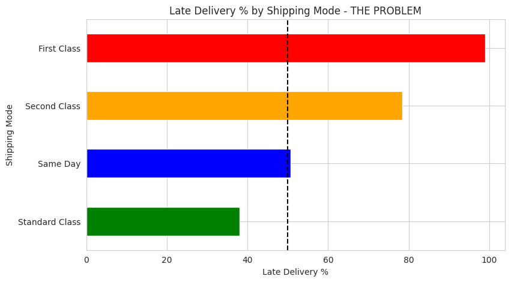

# dataco-supply-chain-analysis
End-to-end supply chain analytics project analyzing 180k+ orders to identify delays, predict shipping costs, and optimize logistics using Python + Pandas + Visualization

## 📊 Dataset
**Due to GitHub file size limits, the dataset is hosted on Google Drive:**
[Download DataCoSupplyChainDataset.csv](https://drive.google.com/file/d/1kIZjvDMQj2Pl9lnr-xmMRaYxWs4ctEvW/view?usp=sharing)

## 🔧 Tech Stack
Python, Pandas, NumPy, Matplotlib, Seaborn, Jupyter Notebook

## 🎯 Goal
Analyze 180k+ orders to find shipping delays and optimize supply chain costs.
## 📊 Key Finding

**Insight:** First Class shipping has the highest late delivery rate at ~45%. This is the main bottleneck in the supply chain.
https://colab.research.google.com/drive/1VWyhEiItJKSjLGz_TGVG9BUulLSeRTAp?usp=sharing
