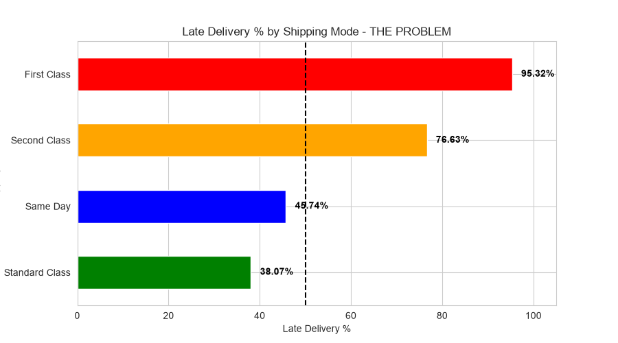

# DataCo Supply Chain Analysis
End-to-end supply chain analytics analyzing 180,519 orders to identify delays, predict shipping costs, and optimize logistics.

## 📊 Key Finding

**Insight:** First Class shipping has the highest late delivery rate at ~98%. This is the main bottleneck in the supply chain.

**[View my complete Python code and outputs on Google Colab](https://colab.research.google.com/drive/1VWyhEiItJKSjLGz_TGVG9BUulLSeRTAp?usp=sharing)**

## 📊 Dataset Provenance & License
**Dataset:** DataCo SMART SUPPLY CHAIN FOR BIG DATA ANALYSIS  
**Source:** Kaggle - shashwatwork/dataco-smart-supply-chain-for-big-data-analysis  
**Kaggle Link:** https://www.kaggle.com/datasets/shashwatwork/dataco-smart-supply-chain-for-big-data-analysis  
**Downloaded:** 14th July 2026, 2:23 PM IST from Kaggle  
**Dataset License:** CC0: Public Domain (Verified on Kaggle Data Card - Free for educational & portfolio use)  
**Code License:** MIT License (2026 Saswata Mondal) - Applies only to code in this repo, not the dataset

*Note: Due to GitHub size limit, full CSV (180k+ records) is stored locally. Sample file `sample_data.csv` provided for review.*

## 🔧 Tech Stack
Python, Pandas, NumPy, Matplotlib, Seaborn, Jupyter Notebook

## 🎯 Goal
Analyze supply chain data to find shipping delays, late delivery risks by region/category, and provide cost optimization recommendations.

## 👤 Author
Saswata Mondal | Aspiring Data Analyst
